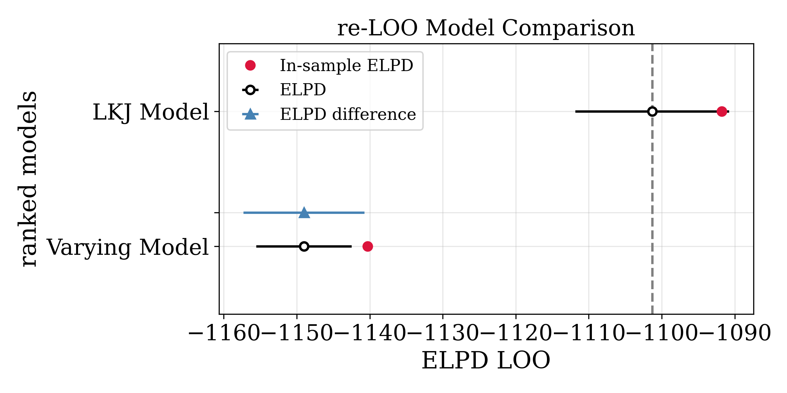

<h1> SDT Bayesian Models </h1>

<p>The present repository contains codes for data simulation and analysis for three signal detection theory (SDT) analyses assessed in a Bayesian workflow manner. </p>

<p>
These resources were of great help:
<p>
1) https://github.com/junpenglao/Bayesian-Cognitive-Modeling-in-Pymc3
</p>
2) https://mvuorre.github.io/posts/2017-10-09-bayesian-estimation-of-signal-detection-theory-models/#evsdt-for-multiple-participants).
</p>

<h1> Generative Model </h1>
<p>
The model is inspired by Lee and Wagenmakers (2013) approach.Two functions are relevant for this approach. These are the Gaussian cumulative density function referred as <i>&Phi;</i>, which relies on the error function <i>erf</i>:
<i>
<p align="center"> erf(z) = (2&div;&Sqrt;&pi;)&int;<sub style='position: relative; down: -1.5em;'>0</sub><sup style='position: relative; left:-0.5em; font-size:small'>z</sup>exp(-t<sup>2</sup>) dt, t = 0...z </p>
<p align="center"> &Phi;(x) = 0.5(1 + erf(x/&Sqrt;2)) </p>
</i>
With these a Bayesian SDT model can be built in the following way:
<i>
<p align="center"> d ~ Normal(0, 1) </p>
<p align="center"> c ~ Normal(0, 1) </p>
<p align="center"> H = &Phi;(d/2 - c) </p>
<p align="center"> F = &Phi;(-d/2 - c) </p>
<p align="center"> y<sub>H</sub> ~ Binomial(H , s) </p>
<p align="center"> y<sub>F</sub> ~ Binomial(F, n) </p>
</i>
We develop a generative model that simulates data with correlated <i>d'</i> and <i>c</i> parameters, namely with an association between sensitivity and bias (Lynn and Barret, 2014). So, the generative model in Python code looks like this:

```python
import numpy as np
from scipy import stats
cdf = stats.norm.cdf #same as Φ

np.random.seed(33)

g = 2 #number of groups (conditions)
p = 100 #number of participants

# simulate experiment where sensitivity (d') is correlated with bias (c)
# as d' increases c decreases  
rho_high = -0.05 #correlation for high sensitivity condition
d_std = 0.5 #d' standard deviation
c_std = 0.5 #c standard deviation
mean = [2, 0.1] #d' mean (2) and c mean (0.5), i.e. high sensitivity and low bias
cov = [[d_std**2, rho_high * d_std * c_std],
       [rho_high * d_std * c_std, c_std**2]] #covariance with correlation
d_high, c_high = np.random.multivariate_normal(mean, cov, size=p).T #generate correlated variables via an mv normal
correlation_high = np.corrcoef(d_high, c_high)[0, 1]

rho_low = -0.6
d_std = 0.5
c_std = 0.5
mean = [1, 0.5]
cov = [[d_std**2, rho_low * d_std * c_std],
       [rho_low * d_std * c_std, c_std**2]]
d_low, c_low = np.random.multivariate_normal(mean, cov, size=p).T
correlation_low = np.corrcoef(d_low, c_low)[0, 1]

sig = np.array([np.repeat(25, p), np.repeat(25, p)]) #fixed number of signal trials (25)
noi = np.array([np.repeat(75, p), np.repeat(75, p)]) #fixed number of noise trials (75)

d_prime = np.array([d_high, d_low])
c_bias = np.array([c_high, c_low])

hits = np.random.binomial(sig, cdf(0.5*d_prime - c_bias)) #derive hits from d' and c
fas = np.random.binomial(noi, cdf(-0.5*d_prime - c_bias)) #derive false alarms from d' and c
```

Image below shows the summary of simulations as receiving operator characteristics (ROC) curves, with area under curves (AUC), and density plots for signal (hits) and noise (false alarms) cdfs.

<p align="center">
	
</p>


</p>

<h1> Model 1 </h1>

<p> We first implement a Base Model with "fixed" parameters across group and participants. Where groups are group 1 (high sensitivity) and group 2 (low sensitivity). </p>
<i>
<p align="center"> d<sub>g,p</sub> ~ Normal(0, 1) </p>
<p align="center"> c<sub>g,p</sub> ~ Normal(0, 1) </p>
<p align="center"> h<sub>g,p</sub> = &Phi;(d/2 - c) </p>
<p align="center"> f<sub>g,p</sub> = &Phi;(-d/2 - c) </p>
<p align="center"> y<sub>H</sub> ~ Binomial(H<sub>g,p</sub> , s) </p>
<p align="center"> y<sub>F</sub> ~ Binomial(F<sub>g,p</sub> , n) </p>
</i>

<p> Where, g = groups (1...G, G=2), p = participants (1...P, P = 100),  s = misses + hits, and n = correct rejections (CR) + false alarms (FA). Observations for y<sub>H</sub> are total hits and observations for y<sub>F</sub> are total FAs. Observations are simulated responses from the generative model presented above.</p>

<h1> Model 2  </h1>

<p> We extend the Base Model (Model 1) via a non-centred parametrisation of Gaussian and half-Gaussian distributions. </p>
<i>
<p align="center"> d<sub>l</sub> ~ Normal(0, 1) </p>
<p align="center"> d<sub>z; g,p</sub> ~ Normal(0, 1) </p>
<p align="center"> d<sub>s</sub> ~ HalfNormal(1) </p>
<p align="center"> d<sub>g,p</sub> = d<sub>l</sub> + d<sub>z</sub>d<sub>s</sub> </p>
<p align="center"> c<sub>l</sub> ~ Normal(0, 1) </p>
<p align="center"> c<sub>z; g,p</sub> ~ Normal(0, 1) </p>
<p align="center"> c<sub>s</sub> ~ HalfNormal(1) </p>
<p align="center"> c<sub>g,p</sub> = c<sub>l</sub> + c<sub>z</sub>c<sub>s</sub> </p>
<p align="center"> H<sub>g,p</sub> = &Phi;(d/2 - c) </p>
<p align="center"> H<sub>g,p</sub> = &Phi;(-d/2 - c) </p>
<p align="center"> y<sub>H</sub> ~ Binomial(H<sub>g,p</sub> , s) </p>
<p align="center"> y<sub>F</sub> ~ Binomial(F<sub>g,p</sub> , n) </p>
</i>

Besides the reparametrized parameters, all other elements in the model remain as in Model 1.

<h1> Model 3 (LKJ Model) </h1>

<p> Finally, we build up a model with LKJ (see Lewandowski et al, 2009) correlation priors to assess the association between sensitivity and bias. </p>
<i>
<p align="center"> &rho;<sub>1</sub>, &rho;<sub>2</sub> ~ LKJCorr(2, 2)</p>
<p align="center"> &sigma;<sub>d1</sub>, &sigma;<sub>c1</sub>, &sigma;<sub>d2</sub>, &sigma;<sub>c2</sub> ~ HalfNormal(1) </p>
<p align="center"> &mu;<sub>d1</sub>, &mu;<sub>c1</sub>, &mu;<sub>d2</sub>, &mu;<sub>c2</sub> ~ Normal(0, 1) </p>
<p align="center"> &Sigma;<sub>1</sub> = [[&sigma;<sup>2</sup><sub>d1</sub>, &sigma;<sub>d1</sub>&sigma;<sub>c1</sub>&rho;<sub>1</sub>], [&sigma;<sub>d1</sub>&sigma;<sub>c1</sub>&rho;<sub>1</sub>, &sigma;<sup>2</sup><sub>c1</sub>]]</p>
<p align="center"> &Sigma;<sub>2</sub> = [[&sigma;<sup>2</sup><sub>d2</sub>, &sigma;<sub>d2</sub>&sigma;<sub>c2</sub>&rho;<sub>2</sub>], [&sigma;<sub>d2</sub>&sigma;<sub>c2</sub>&rho;<sub>2</sub>, &sigma;<sup>2</sup><sub>c2</sub>]]</p>
<p align="center"> d<sub>1</sub>, c<sub>1</sub> ~ MvNormal([&mu;<sub>d1</sub>, &mu;<sub>c1</sub>], &Sigma;<sub>1</sub>) </p>
<p align="center"> d<sub>2</sub>, c<sub>2</sub> ~ MvNormal([&mu;<sub>d2</sub>, &mu;<sub>c2</sub>], &Sigma;<sub>2</sub>) </p>
<p align="center"> d = [d<sub>1</sub>, d<sub>2</sub>] </p>
<p align="center"> c = [c<sub>1</sub>, c<sub>2</sub>] </p>
<p align="center"> H<sub>g,p</sub> = &Phi;(d/2 - c) </p>
<p align="center"> F<sub>g,p</sub> = &Phi;(-d/2 - c) </p>
<p align="center"> y<sub>H</sub> ~ Binomial(H<sub>g,p</sub> , s) </p>
<p align="center"> y<sub>F</sub> ~ Binomial(F<sub>g,p</sub> , n) </p>
</i>

<p> Where LKJCorr are priors for correlations in the covariance matrices <i>&Sigma;<sub>1</sub></i> and <i>&Sigma;<sub>2</sub></i> and now <i>d</i> and <i>c</i> parameters are multivariate Gaussian distributions with Gaussian means and aforementioned <i>&Sigma;</i> covariances.</p>


<h1> Results </h1>
<p> We run prior predictive checks (see prior_predictions folder), which show that priors have good coverage (see image below). We do not calibrate priors as we want to test the fixed priors from the Base Model and see how much the priors from models 2 and 3 can adapt to the "true" values of simulated <i>d'</i> and <i>c</i>.  </p>

<p align="center">
	
</p>

<p> After this, we sampled all models using Markov chain Monte Carlo (MCMC) No U-turn sampling (NUTS) with 1000 tuning steps, 1000 samples, 4 chains. You can see model_convergence folder for all details (i.e. r_hats, ess, etc.), but image below provides a general summary of posteriors and rank plots, indicating good convergence. </p>

<p align="center">
	
</p>

<p> Next we perform a precision analysis, to see whether precision is good enough after 100 samples (i.e. 100 per group). All models reached a reasonable precision of around 0.1. </p>

<p align="center">
	
</p>

<p> After this, we assessed posteriors via scatter plots and Hellinger <i>H<sup>2</sup></i> distance measure (see Pardo, 2018), to see how much the posterior distributions of <i>d'</i> and <i>c</i> differed from their observed (simulated) counterparts. Image below summarises these results.  </p>

<p align="center">
	
</p>

ROC curves plots with AUC measures also indicate better approximations of models 2 and 3.

<p align="center">
	
</p>


<p> Additionally, we performed posterior predictive checks, which indicate similar results. In images below, SDI refers to the Sorensen-Dice Index (see Costa, 2021), which measures similarity between variables.  </p>

<p align="center">
	
</p>


<p> Finally, we conducted a models comparison after using re-LOO on each model (see Vethari et al., 2017, see also: https://python.arviz.org/en/stable/user_guide/pymc_refitting.html). Comparisons indicate higher expected log predictive densities for Model 3. Note that Model 1 has lower in-sample predictive accuracy, which is not ideal. See the model_comparison folder for more details. </p>

<p align="center">
	
</p>

<h1> Conclusion </h1>

<p> Results indicate that the varying (multilevel) model is an improvement over the base model, but it has minor convergence issues. Model 3, with LKJ priors does not only provides the same multilevel parametric form of Model 2 (though centred), but also includes LKJ priors capable of capturing correlations between parameters (<i>d</i> an <i>c</i>) and converges better. Further, Model 3, which is basically just an extension of previous models (i.e. only changes parametrisation, but contains no new variables), approximates simulated measures as well as Model 2 and shows better predictive accuracy. </p>

<h1> References </h1>
<p>
Costa, L. J. (2021). Further Generalizations of the Jaccard Index. https://doi.org/10.48550/arxiv.2110.09619
</p>
<p>
Lee, M. D., & Eric-Jan Wagenmakers. (2013). Bayesian Cognitive Modeling. Cambridge University Press.
</p>
<p>
Lewandowski, D., Kurowicka, D., & Joe, H. (2009). Generating random correlation matrices based on vines and extended onion method. Journal of Multivariate Analysis, 100(9), 1989–2001. https://doi.org/10.1016/j.jmva.2009.04.008
</p>
<p>
Lynn, S. K., & Barrett, L. F. (2014). “Utilizing” Signal Detection Theory. Psychological Science, 25(9), 1663–1673. https://doi.org/10.1177/0956797614541991
</p>
<p>
Pardo, L. (2018). Statistical Inference Based on Divergence Measures. CRC Press.
</p>
<p>
Vehtari, A., Gelman, A., & Gabry, J. (2017). Practical Bayesian model evaluation using leave-one-out cross-validation and WAIC. Statistics and Computing, 27(5), 1413–1432. https://doi.org/10.1007/s11222-016-9696-4
</p>
